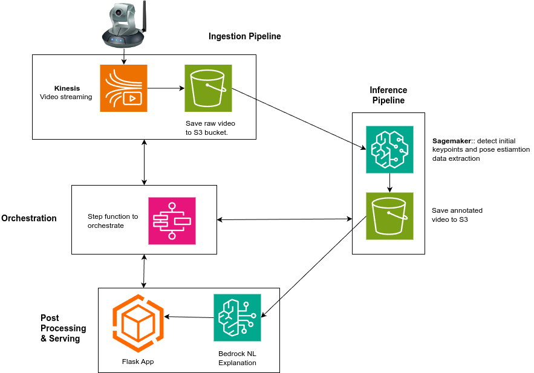
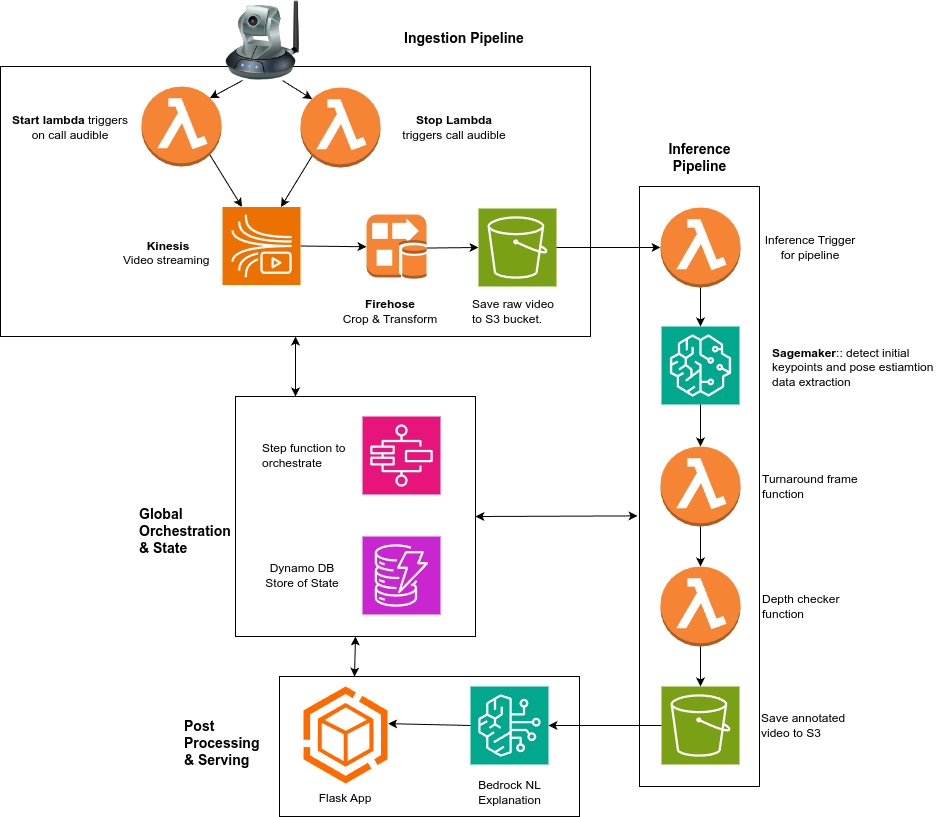

<!-- Slide 1: Title Slide -->
# **RefVision: CV assisted judging for powerlifting**

**Michael Kingston**  
[michael.kenneth.kingston@gmail.com](mailto:michael.kenneth.kingston@gmail.com)  
[LinkedIn: Michael Kingston](https://www.linkedin.com/in/michael-kenneth-kingston)

**Tagline:** *“CV-Assisted Judging for Powerlifting”*

<!-- presenter note 
Imagine training for years, hitting the best squat of your life… only for 3 
judges to tell you ‘No Lift’ – a decision you disagree with, and no way to 
appeal

What if that call cost you $20,000?

This happened a few months ago at the ZeroW Pro

Its common source of tension in powerlifting, and it’s a problem that I 
think we can solve with technology.
-->

---

<!-- Slide 2: Agenda -->
# Agenda

1. **Introduction**
2. **Problem Statement**
3. **Proposed Solution**
4. **Deep Dive into Serverless Components**
5. **Architecture Walkthrough**
6. **Challenges and Solutions**
7. **Future Enhancements & Roadmap**
8. **Q&A**

---

<!-- Slide 3: Introduction -->
# 1. Introduction & Story

**Context**  
- Video Assistant Referees (VAR) are common in sports like football and tennis.  
- Powerlifting faces frequent disputes over “No Lift” decisions, but lacks an appeal system.

**Short Story**  
- A lifter’s squat gets turned down by judges. The lifter disagrees, losing a record attempt and \$20k prize money—no recourse, no replay system.

**Goal**  
- Leverage serverless AWS components to orchestrate a computer vision and natural language processing system for impartial video analysis and real-time feedback.

<!-- presenter note 
-->

---

<!-- Slide 4: Example -->
# A Real-World Example

  <video width="800" height="450" controls>
    <source src="Keeta_squat_1.mp4" type="video/mp4">
    Your browser does not support the video tag.
  </video>

<!-- presenter note
Do you think this was a good lift or a no lift?

The judges decided that it was high, and therefore no lift. That decision cost 
this lifter first place, and $20,000 in prize money.

She and her coach strongly debated the decision, but there was no recourse. 
This seems both unfair and a good opportunity to do things better, and 
create a competitive advantage over other federations.

This was the inspiration for the RefVision project.
-->

---

<!-- Slide 5: Problem Statement -->
# 2. Problem Statement

- **Contentious Calls**: Disagreements on squat depth or movement specifics.  
- **No Appeals Mechanism**: Lifters have no mechanism to challenge a call.  
- **Rising Stakes**: large and growing prize money and records magnify disputes.  
- **Sport Integrity**: Unresolved controversies can diminish trust and viewer engagement.
- **engagement**: experience from other sports show that the strategic introduction of VAR improves viewer engagement.

---

<!-- Slide 6: Proposed Solution -->
# 3. Proposed Solution: RefVision Virtual Referee

**Key Concepts**  
1. **Supplement, Not Replace**: Works with referees, providing an objective second opinion.  
2. **Appeal Mechanism**: One VAR appeal per meet encourages strategic usage without disrupting flow.
3. **Impartial Analysis**: Pose estimation + classification provide a quantitative and verifiable mechanism to judge “Good” vs. “No Lift.”  
4. **Engagement**: Live overlays and natural-language explanations for the audience.

<!-- presenter note
**Key Features**:
- Pose estimation for precise lift judging.  
- Automated “Good Lift” / “No Lift” classification.  
- Natural language explanations (AWS Bedrock).
-->

---

<!-- Slide 7: Quick architecture overview -->

# Basic Architecture

  

<!-- presenter note
**High-Level Flow**  
1. Capture: Video streams from meet → Kinesis + Firehose → S3  
2. Orchestration: Step Functions coordinates tasks  
3. Inference: Pose estimation via SageMaker (with GPU/accelerator)  
4. Explanation: AWS Bedrock for “why it’s Good/No Lift” text  
5. Store & Display: a Flask app to show annotated video
-->

---

<!-- Slide 8: Why Serverless Architecture -->
# Why Serverless? And the Main Challenges

**Benefits**  
- **Cost Efficiency**: Pay ~\$0 when idle; scale up for meet day.  
- **Zero Maintenance**: No servers to patch or manage.  
- **Elasticity**: Automatically handle spikes in traffic or # of lifts.

**BUT**  
- **Accelerators Needed**: Real-time CV inference demands accelerators.  
- **No Native Serverless accelerators**: AWS Bedrock does this for LLMs, but not for computer vision.  
- **Compromise Solution**: SageMaker endpoints for accelerator tasks.

<!-- presenter note
- Quick cost scenario: If the pipeline only runs intensively on meet day (maybe 200 lifts x ~2 minutes each), we pay for GPU usage just during that window. 
- Outside competition days, cost is near zero because the system is largely idle.

# The Main Challenge:  
- **Accelerator Needs**: effective real-time CV video inference demands accelerators
- The delay required to run inference on CPU is unacceptable.
- Pure serverless accelerators (like we have for LLM with Bedrock) don’t exist natively on AWS **yet**.

**Solution**:  
- **Hybrid Approach**: AWS SageMaker endpoints + ECS Fargate for accelerator-based tasks with scale-to-zero configurations.
- **Options**: AWS has its own accelerators (Inf1, Inf2) for SageMaker endpoints, and they are **REALLY GOOD**

- For comparison, each frame takes 1000ms to process on a CPU, but <10ms with an accelerator.
- A lift requires approx 800 frames to be processed, assuming 1080p video at 30fps.
- This means a lift would take 13min to process on a CPU, but 8s on an accelerator.
- I really like Inf2 because they are as fast as an H100 cluster but up to 75% cheaper. They are also much more available
- the only downside is that you need to learn some new tools to make it work. I don't see that as a major issue, but it is something to consider.
- inf2 is available in ap-southeast-2, but you have to apply for access. a small demand is approved automatically
-->

---

<!-- Slide 9: Deep Dive into Serverless Components (intro) -->
# 4. Deep Dive: Key Components
## 4.1: Ingention & Preprocessing

- **Kinesis + Firehose**: Streams and on-the-fly and transforms (e.g., to 
  MP4).  
- **S3**: Stores both raw video.  
- **DynamoDB**: Records critical data for each lift attempt and metadata.

<!-- presenter note
We avoid analyzing random frames. 
We rely on the bottom of squat logic: track the hip and knee velocity to find the “turnaround” frame.

**Workflow**:
1. **Trigger**: an audio trigger starts the step function, and the video stream starts.
2. **Lift Data**: the meet software sends a JSON payload with lifter data 
   (name, lift, attempt number, etc.) at the same time as the video stream.
3. **Camera Feeds → Kinesis Video Streams**: Real-time streaming of video
4. **Preprocessing**: Firehose performs real-time cropping, resizing, and video format transformations
5. **Storage**: Kinesis stores the video in **S3** bucket
6. **DynamoDB**: Records metadata (lifter data, timestamps, chunk references).  
7. **AWS Lambda**: multiple triggers for kinesis & firehose, and updates DynamoDB.

**Why**:
- Kinesis streams live video.
- Firehose pre-processes video on the fly. Different cameras generate different video formats and contain different metadata that can mess up our inference. we need to  convert all video files to mp4 and strip all metadata before inference
- we store the original videos separately from the processed videos, because they're usefule for further fine tuning of existing models and development of new models
- DynamoDB tracks all the metadata for each lift.
- the step function coordinates everything
-->
---

<!-- Slide 10: DynamoDB -->
## 5.2 DynamoDB
- Central “store of state” for each attempt:  
  - Preprocessing status  
  - Inference results  
  - Explanation text  
  - Timestamps, lifter info

---

<!-- Slide 11: DynamoDB Data Model -->
# Data Model
  - **Partition Key**: `LifterID_LiftID`  
  - **Sort Key**: `datatype_timestamp`

| Partition Key | Sort Key                    | Metadata                |
|---------------|-----------------------------|-------------------------|
| 12345_Squat1  | Video_20240216T123456       | Preprocessed frame data |
| 12345_Squat1  | Inference_20240216T123456   | Inference results       |
| 12345_Squat1  | Decision_20240216T123456    | “Good Lift” / “No Lift” |
| 12345_Squat1  | Explanation_20240216T123456 | LLM explanation         |

<!-- presenter note
why do we need a store of state?

In this project, we're dealing with multiple asynchronous serverless 
components that need to coordinate video ingestion, preprocessing, inference, explanation generation, and result storage. DynamoDB serves as a centralised store of state, ensuring smooth orchestration and tracking across different AWS services.

- partition key: a composite key of lifter ID and lift ID
- sort key: a composite key of data type and timestamp
-->
---

<!-- Slide 12: AWS Step Functions -->
## 5.3 AWS Step Functions: Orchestrator

- **Orchestrator**:  
  1. Waits for preprocessed frames  
  2. Triggers inference  
  3. Collects results, triggers explanation  
  4. Updates final status in DynamoDB  
- Built-in retries & parallelisation if needed

<!-- presenter note
Role: Central Orchestrator for the entire pipeline.

Why: Eliminates “spaghetti code” for orchestrating multiple services. is used to orchestrate the RefVision pipeline because it provides a serverless, reliable, and fault-tolerant way to manage the different stages of video processing, inference, and explanation generation.

the Step function is the conductor
DynamoDB is the state memory store

The step function:
✅ Handles Failures & Retries Automatically → If a step fails, Step Functions can retry without reprocessing everything.
✅ Ensures Proper Execution Order → Each step runs only when the previous one completes successfully.
✅ Integrates Seamlessly with DynamoDB → It checks the processing state in DynamoDB and triggers the next action when ready.
✅ Reduces Code Complexity → Instead of managing state manually in multiple Lambda functions, Step Functions visually define the execution flow.
-->

---

<!-- Slide 13: Inference with SageMaker -->
## 5.3 Inference (SageMaker)

1. **Inference (SageMaker)**  
   - YOLO11 Pose or PoseFormer run on GPU.  
   - Output: Keypoints (hip, knee) and classification.  
   - Writes “Good Lift” or “No Lift” to DynamoDB.

<!-- presenter note
- this is the only non-serverless part of the pipeline.
- I tried many workarounds to make this serverless, but was unsuccessful
- I'm hoping that AWS will release a serverless accelerator soon. This could be done on lambda.
-->

---

<!-- Slide 14: Explanation Generation with AWS Bedrock -->
## 5.4 Explanation Generation (Bedrock)
**Explanation (Bedrock)**
   - Bedrock is a joy to work with.
   - Lambda is invoked once inference is done.  
   - Passes keypoints + classification → LLM for a short explanation of 
     decision.  
   - Example: 
>The squat was a ‘No Lift’ because the hip was 2cm above knee depth at the bottom.”

<!-- presenter note
in most cases the visual explanation provided by the skeleton overlay is 
enough to see why the lift failed, however there are a lot of reasons (30) 
why a lift might fail, that may not be immediately obvious to the audience. 

Its also really helpful to the commentator to have an explanation to hand 
to explain a decision to the audience, even if the lifter has not chosen to 
appeal the lift
-->
---

<!-- Slide 15: Web App & Delivery -->
## 4.6 Web App & Delivery (Flask + CloudFront)

- **Flask** (or FastAPI)  
   - Serves a simple UI for judges & audience.  
   - Pulls annotated video from S3.  
   - Fetches classification + explanation from DynamoDB.

- **CloudFront**  
   - Caches static media (annotated videos) for fast delivery.

---
<!-- Slide 16: Diagram -->

**Flow Diagram**:  

  

---

<!-- Slide 17: Architecture Walkthrough -->
# 5. Architecture Walkthrough

**Comprehensive Flow**:
1. **Live Capture**: Camera → Kinesis → S3  
2. **Preprocessing**: Lambda triggered by DynamoDB  
3. **Step Functions**: Coordinates inference steps  
4. **Inference**: Pose detection via SageMaker
5. **Explanation**: AWS Bedrock → DynamoDB  
6. **Annotated Video**: S3 for final media  
7. **Web App**: Displays decisions, explanations

---
<!-- Slide 18: Example output -->

# Output: Annotated video with skeleton overlay

  <video width="800" height="450" controls>
    <source src="theo_maddox_squat_2.mp4" type="video/mp4">
    Your browser does not support the video tag.
  </video>

<!-- presenter note
I'm not going to show you a clean output. I want you to see one of the key 
issues with the model.
-->

---

<!-- Slide 19: Challenges & Solutions -->
# 6. Challenges & Solutions

1. **Serverless Accelerator Gap**  
   - **Solution**: SageMaker endpoints scale to near-zero usage/cost off-peak.

2. **Asynchronous Coordination**  
   - **Solution**: Step Functions + DynamoDB to orchestrate and track statuses.

3. **Accuracy & Multi-Person Scenes**  
   - **Solution**: Fine-tune YOLO or add a classifier for “who is the lifter?”

4. **Human Trust & Acceptance**  
   - **Solution**: Position it as an assistive tool, not a referee replacement.

---

<!-- Slide 20: Future Improvements -->
# 7. Future Technical Improvements

1. **Multi-Camera Integration**  
   - Emulate the three judges’ perspectives simultaneously.

2. **Fine tuning Models**  
   - Distinguish the lifter from handlers, audience, or background clutter.
   - capture the more nuanced rules of powerlifting

3. **Broader Sports & Markets**  
   - Expand to Olympic weightlifting (snatch, clean & jerk).
   - Exercise physiology and rehabilitation
   
4. **RefVision as a Service**  
   - Subscription-based API for other sports or rehab contexts.

<!-- presenter note
As you can see from the demonstration, the model struggles to focus on the lifter when there are multiple people in the frame. It also struggles with occlusion. The solution is relatively straightforward: the lifter is the person holding the  barbell. However, computer vision models for video are generally trained on COCO, and "barbell" is not a class in COCO.

Many of the rules in powerlifting are more nuanced than comparing relative keypoints at a moment in time and require fine turning on a custom, labelled dataset to judge failures based on all modalities.

It would be a legitimate criticism to say that the current tool is biased 
because it looks from only one angle. This needs to be corrected. we need 
to use 3 cameras to capture the lift from the perspective of all 3 judges.
-->

---

<!-- Slide 21: Business Model -->
# Business Model
- Licensing RefVision to powerlifting federations.
- Offering an on-demand API service for coaches & lifters.
- Expand into other sports (Olympic weightlifting).
- Expand into exercise physiology and rehabilitation.

---

<!-- Slide 22: Q&A -->
# Q&A

If you're interested, please check out the code on GitHub:

  

*Thank You!*  
Contact: **michael.kenneth.kingston@gmail.com**

<!-- presenter note
Possible Question
- What if the AI makes a mistake? -> RefVision is designed to be a supplemental tool, not a replacement. It provides additional objective evidence for review.
- How do you handle different camera angles? -> Future versions will use multi-camera setups to simulate how all 3 judges view a lift.
- Why not just let referees decide? -> RefVision isn’t replacing referees—it’s enhancing fairness by providing an objective second opinion where humans disagree.
-->
---